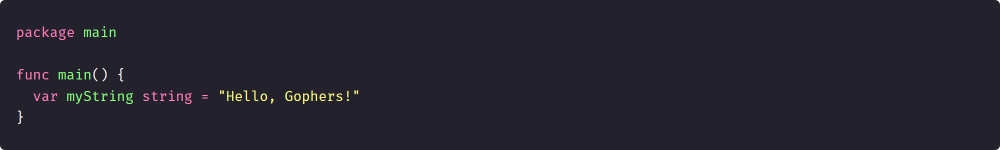

# 0 / 30 Days of (Explained) Code: Hello World

### Hello, refactored chimps!

This is `post[0]` of a series of `[30]Post` destined to new Gophers and sympathizers.

In this series, we are going to explore fundamental Go concepts while solving basic algorithm problems. By the end, you should have a general view of Go and be able to understand and write some Go code on your own.

If you’re looking for a problem-based approach for beginners, this is the place for you!

---

### Day 0: Hello, World
Today we are going to code the genesis of all algorithms ever written in any language: the classic “Hello, World”.

But don’t mistake yourself! For a simple algorithm as such, we are going to cover:
* Go packages and code structure
* the `fmt`, `os`, and `bufio` packages from Go's standard library
* the 4 declarative forms that Go allows

---

### What is the problem?
The problem consists of outputting to the console both the statement `Hello, World.` and an input read from `Stdin`.

To complete this challenge, we need to:
1. Save a line of input from `Stdin` to a variable
2. Print `Hello, World.` to the console on a single line
3. Print the value from step 1 on a second line

For the full problem description, go to [HackerRank’s Day 0: Hello, World](https://www.hackerrank.com/challenges/30-hello-world/problem).

---

### What do we need to know about Go?
#### Go packages and code structure
Go deals with source code using packages. Therefore, every source code file must start with a package declaration. We declare packages by typing the keyword `package` followed by the package’s name. The package’s name must be the same as that of the file. So if we have a `package myPackage`, we need to store it inside of the `myPackage.go` file.

For every Go application, `main` is the pre-defined executable package. Go uses this package to generate an executable that runs our program. The package must be inside of the `main.go` file, and it must present a function called `main`, which we declare by typing `func main()`.

Packages can also be exported and imported to enable code reuse. That means you can write multiple packages and reuse those somewhere else simply by importing them. To import packages, we use the keyword `import`.

There are two ways of importing packages: single package or multi-package import. To import a single package, we type `import` and the package’s name between double quotes.

To import multiple packages at once, we declare the packages inside of parentheses, separated by line breaks.

The package statement, package import, and function declaration form the basic code structure for all Go programs.

#### The `fmt`, `os`, and `bufio` packages from Go's standard library
Go has a list of supported standard and community [Packages](https://golang.org/pkg/). We are going to use three packages from Go’s standard library: `fmt`, `os`, and `bufio`.

##### `fmt` and formatting output

The [`fmt`](https://golang.org/pkg/fmt/) package provides functions to format input and output. After importing `fmt` into our package, we access these functions by typing `fmt.FunctionName()`.

`Print`, `Printf`, and `Println` are 3 of the functions that can be used to handle output. Here, we are going to focus only on the formatting differences.

When using [`fmt.Print()`](https://golang.org/pkg/fmt/#Print) to output a `string`, we need to manually format the output by adding the necessary space and line breaks.

[`fmt.Printf()`](https://golang.org/pkg/fmt/#Printf) allows us to write the same `string` as a straight line by referencing the variables with format specifiers. Format specifiers are operators that identify the type of data stored in a variable. They are represented by a percentage operator and a character that indicates data type. For example, `%d` is used for `integer` and `%s` for `string`.

Finally, [`fmt.Println()`](https://golang.org/pkg/fmt/#Println) facilitates formatting by adding spaces between operands and a line break by the end of the output. Therefore, we could simply write:

##### `os`, `bufio`, and reading standard input
The [`os`](https://golang.org/pkg/os/) package provides an uniform interface to work with operating system functionality across all operating system platforms. `os.Stdin` is the functionality we will use to point to `Stdin` when reading input with the `bufio` package.

The [`bufio`](https://golang.org/pkg/bufio/) package implements buffered input and output functionality. It allows for different ways of reading input, but we will focus on `type Scanner`.

[`Scanner`](https://golang.org/pkg/bufio/#Scanner) provides an interface for reading newline-delimited lines of text. To work with it, we provision a `Scanner` object, pointing it to `Stdin` by using `os.Stdin`.

The [`Scanner.Scan()`](https://golang.org/pkg/bufio/#Scanner.Scan) function responds with `true` or `false` to indicate if there is any input available. After finding an input, [`Scanner.Text()`](https://golang.org/pkg/bufio/#Scanner.Text) returns the full input as a `string`.

#### The 4 declarative forms that Go allows
Go supports 4 ways of declaring variables. We already saw 3 of them above, but we are going to cover them all in more detail.

The standard syntax for declaring a variable is the keyword `var` followed by the variable’s name and its type. We can assign a value to the variable anywhere inside the block scope.

If our variable has a well-known initial value, we can initialize it along with its declaration. In this case, we type the assignment `=` operator followed by its initial value.

One thing you may have noticed by now is that Go is a strongly, statically typed language. Therefore, we must always indicate the type of the data which will be stored in our variable.

But the Go compiler is capable of inferring data type based on the data that is stored. That means, if we assign a `string` to a variable, it will automatically declare that variable as being of `string` type. This way, we can omit the data type from the previous declaration.

There’s an even shorter way of declaring variables in Go: the short declaration. It doesn’t require the `var` keyword nor the data type. We only need to write the variable’s name followed by the colon equals `:=` operator and the initial value.

All the previous declarative forms support multi-variable declarations and assignments, separated by commas.

Now, I believe we know everything we need in order to solve the challenge. Time to get our hands dirty.

---

### Step-by-step coding explained
To start any Go program, we need to declare the package we are working on.

#### Save a line of input from `Stdin` to a variable
The first step towards the solution is attributing the input from `Stdin` to a variable. To work with `Stdin`, we will need `os` functionality. We will also use `bufio` to `Scan` the input. Therefore, we must import these two packages. For that, we are going to use the multi-package import syntax.

Let’s start our code inside of the `main` function by instantiating a `Scanner` object. In order to read input, we need to point `Scanner` to `Stdin` while instantiating it.

We also need a variable to store the `string` being passed as input. In this case, since there is no initial value, we are going to use the standard syntax.

One new thing to mention is, Go’s name convention tells us to use the first letters of the words that best represent the data or role of our variables and functions. Despite using descriptive `camelCase` during explanation, we’ll always follow this convention when writing actual code. Thus, we’ll call our **i**nput **s**tring `is`.

Now we can use the `Scan()` function to check for input and the `Text()` function to store the input in our `is` variable.

#### Print `Hello, World.` to the console on a single line
To print something to the console, we need the `fmt` package. So let’s add it to our `import` statement.

After importing `fmt`, we are ready to use any of the 3 output functions we saw to print out the `Hello, World.` statement. I’m using `Println()`, but feel free to try another one.

#### Print the value from step 1 on a second line

The last step is to print out the value we read from `Stdin`. This value is stored in our `is` variable. Since it's the last output, I’m using `Print()` this time.

That completes the challenge, the full code as follows:

---

### Key Takeaways

* Every Go program starts with a package declaration.

* `main` is the one and only executable package in a Go program.

* You can reuse code by exporting and importing packages.

* Go supports several standard and community packages.

* You can use the `fmt` package to format input and output, including the `fmt.Print()`, `fmt.Printf()`, and `fmt.Println()` output functions.

* You can use the `bufio` and `os` packages to read input by instantiating a `Scanner` object pointed to `Stdin`.

* When using `Scanner`, `Scan()` returns `true` when there’s input and `Text()` returns the input as a `string`.

* Go allows 4 ways to declare variables. All these ways support both single and multiple declaration and attribution.

* Go’s convention is to name variables or functions by using the first letters of each word that best describes their value or role.

---

### Full commented solution

---

### Resources

* Source code: [main.go](./main.go)
* Cheat sheet: [d0-c.pdf](../../../resources/30doec/d0-c.pdf)

---

### What's next?

Day 1: Data, Types is still cooking...
