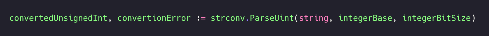

# 1 / 30 Days of (Explained) Code: Data Types

### Hello, refactored chimps!

This is `post[1]` of a series of `[30]Post` destined to new Gophers and sympathizers.

In this series, we are going to explore fundamental Go concepts while solving basic algorithm problems. By the end, you should have a general view of Go and be able to understand and write some Go code on your own.

If you’re looking for a problem-based approach for beginners, this is the place for you!

---

### Day 1: Data Types
Today we'll see how to receive multiple inputs, execute some basci data operations, and output the results. For that purpose, we are going to cover:

* all numeric and text data types supported by Go (spoiler: there are many)
* the Go's `+` operator to sum numbers and concatenate text
* the only loop available in Go, and its different forms
* all conditional structures, and how Go differs from other languages
* how to convert a text into a number using Go's `strconv` package

We're also using all the stuff we learned in the previous post. In case you missed it, check out the [Day 0: Hello, World](../d0/).

---

### What is the problem?
The problem consists of reading 3 inputs from `stdin`: 1 integer, 1 floating-point, and 1 text; summing the numbers, concatenating the text, and outputting the results.

1. Assign 1 integer input to a variable
2. Assign 1 floating-point input to a variable
3. Assign 1 text input to a variable
4. Output the sum of `i` and the integer from step 1 in the first line
5. Output the sum of `d` and the floating point from step 2 in a second line
6. Output the concatenation of `s` and the text from step 3 in a third line

The `i`, `d`, and `s` variables are pre-declared and initialized, and correspond to the types integer, floating-point, and text, respectively. We don't need to worry about them beyond this.

For the full problem description, go to [HackerRank’s Day 1: Data Types](https://www.hackerrank.com/challenges/30-data-types/problem).

---

### What do we need to know about Go?
#### Basic data types
Go offers 15 [numeric types](https://golang.org/ref/spec#Numeric_types). Each type presents a defined bit-size and either supports negative values or not.

##### Integers and natural numbers
Go differentiates integers that can assume negative values from thos which cannot. In mathematical words, Go treats integers and natural numbers differently.

Integers are all positive and negative counting numbers, including 0: {..., -2, -1, 0, 1, 2, ...}. In Go, these are called _signed_ integers and can be 8, 16, 32, or 64 bits in size. Go also provides a signed integer which is either 32 or 64 bits in size, depending on the architecture of the underlying system that is running the program. These types are `int8` (also referenced as `byte`), `int16`, `int32`, `int64`, and `int`, respectively.

Natural numbers groups only the positive integers, including 0: {0, 1, 2, 3, 4, 5, ...}. In Go, these are called _unsigned_ integers. They can also be 8, 16, 32, or 64 bits in size, or assume a size based on the underlying architecture. The types are respectively `uint8`, `uint16`, `uint32` (also referenced as `rune`), `uint64`, and `uint` - where _u_ stands for unsigned.

There's another data type called `uintptr` which stores integers that represent memory addresses. But this is out of scope for this conversation, so we'll save it for some other time.

##### Floating-point numbers
The data types for representing floating-point numbers or _floats_ are only two: `float32` for 32-bit values and `float64` for 64-bit values.

##### Complex numbers
Complex numbers are also fully represented by their own data types. These data types use a pair of `float32` or `float64` to represent the real and imaginary parts of a complex number. We won't go any further into it for now.

##### The text type
Differently from many modern programming languages, te only text type available in Go is `string`. That's because Go treats strings as read-only sequences of bytes, and a character is represented by a `byte` (`uint8`) or `rune` (`int32`).

There are many built-in functions to manipulate a `string`. We already saw some of them in the [previous post](../d0/): `Print()`, `Printf()`, and `Println` from the `fmt` package, for output; and `Text()` from the `bufio` scanner, for capturing input.

To initialize a `string`, we place its value between backticks ``My string value`` or double quotes `"My string value"`. I'll be using double quotes by default, but feel free to use either format.

#### The + operator
There are 11 [arithmetic operators](https://golang.org/ref/spec#Arithmetic_operators) available in Go. Here we're covering only the one we need to solve our challenge: the sum operator `+`.

The `+` operator can be used to manipulate all data types we saw previously: integers, floats, complex numbers, and strings. Let's see `+` working with numerical types first.

##### Adding numbers
When working with numerical types, the sum operator performs an addition of the two operands placed before and after the `+`. I'll skip complex numbers for now, but here's how it looks like for integers and floats:

##### Adding strings
When working with strings, the sum operator performs a concatenation of the two operands placed before and after the `+`. A concatenation is similar to an addition, in which two strings are assembled to become one. We saw an example in the [previous post](../d0/), while playing with the different `fmt` [functions](https://play.golang.org/p/S12Sr_yKOy1) to output data.

#### Looping
Despite using it in our [previous post](../d0/), we didn't learn about looping constructs yet. Now it's time.

Differently from most languages, Go has only one looping construct: [`for`](https://golang.org/ref/spec#For_statements). But it can be used in 4 ways, so there's no need for more constructs.

The [default](https://tour.golang.org/flowcontrol/1) `for` structure looks like many `for` loops you might have seen in other languages. It is composed of an initialization, a condition, some instructions, and a post action.

The initialization is executed before the first iteration _only_, and includes an assignment to the variable we'll use to control how many iterations our loop will perform. It is placed right after the `for` keyword, followed by a semicolon `;`.

The condition is a statement our loop evaluates before each iteration. If the condition is `true`, `for` executes the instructions nested in its scope. The condition comes after the initialization, and is also separated by a semicolon.

Instructions are the lines of commands our program will execute in case the `for` condition evaluates as `true`. They are placed between curly brackets `{}`, and only exist inside the `for` scope. That means, if we generate a value inside our `for` loop, it will not be accessible from anywhere else in our code.

This is important to understand because it impacts on how we declare variables and manipulate data. But don't worry, we'll have a deeper discussion about scope sometime in the future. Meanwhile, you can refer to Michał Łowicki’s [Scopes in Go](https://medium.com/golangspec/scopes-in-go-a6042bb4298c).

Finally, post action is the command our `for` loop executes at the end of each iteration, and it consists of a modification to the variable we initialized before - usually an increment or decrement. We place the post action after the condition and before `{`.

Our `for` loop will execute the initialization before the first iteration, and then evaluate the condition. If the condition is `true`, our program will execute the instructions, execute the post action, and reevaluate the condition once again. This will happen until the condition is `false` due to modifications to the initialized variable. In this case, our program will ignore the whole block of instructions inside the `for` scope, skipping to whatever comes after `}`.

In Go, the initialization and postAction are [_optiona_](https://tour.golang.org/flowcontrol/2). We can omit them by leaving a black space before the divisors (`;` or `{`). This is particularly useful when the variable in our condition has already been initialized before our loop _and_ will be modified inside our loop. Refactoring the example above:

We can also skip the initialization and post action completely. Therefore, we don't need the blank spaces or divisors around the condition statement. If you have coded in another language before, this looks a lot like a [`while` loop](https://tour.golang.org/flowcontrol/3). And who am I to say it is not?

The last way to use `for` is by creating an [infinite loop](https://tour.golang.org/flowcontrol/4). I know, right? Everyone who took a coding class somewhere was probably warned about the dangers of infinite loops. Still, many times we create them accidentally. Go gives one step ahead by allowing us to create them _on purpose_. It means the condition is _optional_ too.

To create an infinite loop, we omit everything and just declare the `for` keyword and its scope. But it's important to remember that, despite the name, infinite loops should _not_ run forever. In order to `break` the loop, we still need a condition inside our `for` block.

#### Conditionals

Conditionals are constructs we use to make decisions inside our code. We already saw in the last example the `if` and `else` construct, but we'll take a step back to discuss the `if` alone.

##### If, else, and else if
[`if` statements](https://golang.org/ref/spec#If_statements) are pretty simple: they have a single condition which is evaluated once. If the condition is `true`, our program runs the instructions inside of the [`if`](https://tour.golang.org/flowcontrol/5) block of code. Otherwise, it skipes that block, jumping to the next command.

Ok, the `if` statement block allows us to execute code in case a condition holds `true`. But what if I want code to execute only when the condition is `false`? Well, we use the [`else` block](https://tour.golang.org/flowcontrol/7), like we saw in our infinite loop example. The `else` block of code will come right after an `if` block, and will only execute when the `if` statement is `false`.

We could evaluate different conditions using several `if` statements, but Go provides and `else if` construct to make multiple evaluation more productive. Why is it more productive? Because `else if` allows us to state a new condition that, like an `else` block, will only be evaluated in case the previous `if` condition is `false`.

Too confusing? Let's go over it step by step. First, there's an `if` condition. When the `if` condition is `true`, our program executes the commands inside of the `if` block and skips all the other nested `else if` and `else` blocks. When the `if` condition is `false`, our program looks for the first nested `else if` or `else` block available. In chase there is an `else if`, our program evaluates its condition and determines whether to execute or skip its block of code. This will happen until our program hits a `true` condition or the `else` code.

Remember: `else if` blocks, like `if` blocks, will only execute when the condition is `true`. `else` blocks will always and _only_ execute when all previous conditions are `false`.

There is virtually no limit for nestsed `else if` conditions, but each one `if` block can only have one `else` block.

##### Switch case
Another way of evaluating multiple conditions is by using the [`switch case` construct](https://golang.org/ref/spec#Switch_statements).

In a [`switch case`](https://tour.golang.org/flowcontrol/9), we have a `switch` value to be evaluated, one or more `case` conditions to evaluate against, and an optional `default` block that will execute when no previous condition is met, similar to an `else` block.

If you've worked with another language before, it's worth saying Go's `switch case` is a bit different from the usual. First, it only runs the first `case` block that meets the condition. That means we don't need to add a `break` statement inside of each `case` block; Go nativelly skips all the following conditions and moves on to the end of the `switch`. Second, values evaluated by `switch case` conditions don't need to be integers nor constants.

For those with no previous knowledge, just know that you can use `switch case` to evaluate both constants and variables of any data type. Your program will evaluate the conditions top-down and only execute the block of code that first meets your condition. skipping all the rest.

#### Converting strings to numeric data types
To complete the challenge, we'll need functionality from the `strconv` package.

[`strconv`](https://golang.org/pkg/strconv/) is a Go package that provides tools to convert strings into other basic data types, such as the [numeric](https://golang.org/pkg/strconv/#hdr-Numeric_Conversions) ones we saw above.

##### String to integer
If you remember from the beginning of this conversation, Go deals with two types of integers: signed integers `int`, which cover all counting numbers, including negative numbers; and unsigned integers `uint`, which only cover positive numbers and 0.

There are 3 methods for converting strings to integers: `ParseUint()`, `ParseInt()`, and `Atoi()`.

[`ParseUint()`](https://golang.org/pkg/strconv/#ParseUint) is used to convert from `string` to `uint`. It receives 3 arguments: the string to be converted, a number representing the base or rdix of the desired integer, and a number to represent the desired integer's size in bits - either 8, 16, 32, or 64.

The `ParseUint()` function returns an `uint` value based on the specified radix and with the provided bit size, along with an `error` value. Therefore, when receiving an output from `ParseUint()`, we need to provide two variables: one for the converted `uint` and another for the `error`. We do that using the multi-value short declaration we saw in the [previous post](../d0/).

[`ParseInt()`](https://golang.org/pkg/strconv/#ParseInt) looks and functions exactly like `ParseUint()`, but it converts from `string` to `int`.

[`Atoi()`](https://golang.org/pkg/strconv/#Atoi) is like a "short-cut" for `string` to `int` conversions. It assumes the integer radix is 10, which corresponds to decimals; and the bit-size is 0, which converts to `int` - the architecture-dependent data type.

The `Atoi()` method also returns an `error`, but only receives one parameter: the `string` to be converted.

##### String to float
To convert from `string` to `float`, we use the `ParseFloat()` function.

[`ParseFloat()`](https://golang.org/pkg/strconv/#ParseFloat) only requires two arguments: the `string`to be converted and a number that indicates desired bit-size - either 32 or 64. It then returns then returns the converted float and an `error`.

One curious thing is, `ParseFloat()` always results in a `float64` number, even when we specify 32 as the bit-size argument. The only difference is, when we pass bit-size as 32, we can convert the resulting `float64` number to `float32` without changing its value. In other words, the converted float will always be of type `float64`. If you want `float32`, you need to pass 32 as the bit-size argument and then _convert_ the output from `float64` to `float32` before storing it.

Don't worry if you didn't get this last part, we won't use it. Just remember: if there's an `error`, make sure you declared the converted float variable as of type `float64`.

For now, I believe we know everything we need in order to solve the challenge. Time to get our hands dirty.

Let's Gopheround!

---

### Step-by-step coding explained
First and foremost, let's take a look at what has already been provided to us.

HackerRank already declared the package we are working on, `package main`. It also imported all the packages we will _have_ to use to solve this challenge: `strconv` to make conversions, and `fmt`, `os`, and `bufio` to work with input and output - we saw the last 3 in the [previous post](../d0/).

Inside of the `func main()`, HackerRank pre-declared and initialized the 3 variables we'll need to realize the expected operations: 1 64-bits integer of value 4, `var i uint64 = 4`; 1 64-bits float of value 4.0, `var d float64 = 4.0`; and 1 text of value "HackerRank ", `var s string = "HackerRank "`. It also pre-declared and instantiated a `NewScanner()` which we'll use to read input from `os.Stdin`.

One particularity about HackerRank's methodology is, the initial code provided by the platform _cannot_ be changed. It is used to determine how we are going to solve the challenge.

In our case, that means we cannot add or remove imported packages, and we will have to use all of them in our code. We'll also have to use `scanner` somwhere - Go doesn't like when we import or declare things we won't use.

Now that we understand the rules of the game, let's play with it.

#### Assing 1 integer input to a variable
The first step is to read input from `Stdin`.

Hopefully, you remember from the [previous post](../d0/) that `bufio`'s `Scan()` needs a loop to iterate for as long as there is input available. In other words, `Scan()` only read one input at a time. This thie, we need to read 3 different inputs, therefore we'll need to iterate 3 times.

To do so, we'll initialize a variable in a `for` statement; present a condition to break out of the loop after 3 iterations; and increment or decrement that variable after each iteration, based on the strategy we adopt. In my case, I'm using the default `for` structure to iterate from 0 to 2 (`i = 0`, `i = 1`, and `i = 2`), but feel free to use any other format or path to get to the same result.

We narrowed the input reading loop, time to actually call `Scan()`. Remember: HackerRank instantiated `bufio.NewScanner(os.Stdin)` by the name `scanner`.

In this challenge, we are not only reading 3 different inputs, we are reading 3 different _types_ of data. Fortunately, based on the problem description and pre-initialized variables, we know exactly what types of data and in which order they will come.

The order in which data will come corresponds to the iteration in which data will be scanned: the first input will be read in the first iteration and so on. Knowing that, we can use conditionals to store each data to its corresponding variable. I'm picking `switch case`, but feel free to try it out using nested `if`, `else if`, and `else` statements.

In the first iteration, when `i = 0`, we'll scan an integer which we'll need to store in a variable. Since we'll summ the input to the pre-initialized `var i uint64`, it's safe to assume our variable must be of type `uint64` too. We also need it to be accessible in the whole `func main()` scope, since we'll read it from the _inside_ of the `for` loop and output it from the _outside_ of the `for` loop.

Notice that I'm using the name convention to name our variable wich will store the integer value as `iV`.

Back to the `for` loop, we can now store the input from the first interation (`i = 0`) in our `iV`variable. To do so, we need `bufio`'s `Text()`.

Here's another hole in the road: `Text()` only returns `string` values. That means `Text()` will receive and pass the input to `iV` as being of type `string`. To work with other data types, we'll need to convert `Text()`'s output. In this case, we'll use the `strconv.ParseUint()` function to convert from `string` to `uint`.

We just saw that `strconv.ParseUint()` requires 3 arguments: 1 `string` to be converted, 1 `int` to represent the desired radix for the conversion, and 1 `int` to represent the desired size in bits. It also returns 2 values: 1 `int` with the pointed size and 1 `error` value.

In our example, we assinged the `error` value to a variable. Since we're not doing any `error` handling by now, instead of a variable, I'll use the blank identifier `_`.

Blank identifier `_` is a special feature to avoid errors generated by unused variables - as I said before, Go doesn't like when we declare things we won't use. We can also use it to "misplace" a value during an attribution, like we'll do below. In our case, the `error` value will simply "get lost", and Go won't mind that we never uside it in our code.

Warning: ignoring erros is a terrible practice for real-life problems. Also, the blank identifier must be used with due diligence. I canor reinforce these enough.

Reading the first input (`case 0`) goes as follows: `iV` receives an integer from `strconv.ParseUint()` wich converts the `scanner.Text()` input from `string` to `uint64` using base 10.

#### Assign 1 floating-point input to a variable
In the second iteration, `i = 1`, we'll scan a float value which the pre-initialized `var d float64` enforces to be a `float64`. The scope needs for our float variable are the same, and we'll keep the name convention going - `fV` for float value.

Our `case 1` instruction is similar to `case 0`, but we'll convert from `string` to `float64` this time. So let's use `strconv.ParseFloat()` instead.

`strconv.ParseFloat()` requires 2 arguments: 1 `string` to be converted and 1 `int` to represent the desired size in bits. And it returns 2 values: 1 `float64` and 1 `error`. We'll assign the `error` to the blank identifier once again.

#### Assign 1 text input to a variable
Finally, our `case 2` and last instruction will receive a `string` value, and we'll create a variable `sV` to store it.

Since we're receiving a `string`, we don't need to convert the `scanner.Text()` output.

That finishes our `for` loop.

Now that we correctly scanned and stored all 3 inputs, let's execute the necessary operations and output the result.

#### Output the sum of `i` and the integer from step 1
In the [previous post](../d0/), we saw different `fmt` methods to output data. Today, I'm going to use `Printf()`, but always feel free to walk your own way.

Remember to manipulate and output data _after_ the `for` loop so all variables have some value to operate.

The first value we need to output is the sum of `i` and the `int64` input stored in `iV`. To add two numbers, we use the `+` operator.

The default flow would be to create a variable and store the sum result. Since we're not using this value anywhere else, I'm going to simply output it straight to the `Printf()` function. I'll do it by referencing the integer verb `%d`. It looks as follows:

#### Output the sum of `d` and the floating-point from step 2
The second value is the sum of `d` and the `float64` input stored in `fV`. Again, we use the `+` operator to add these two numbers and output the result using the float verb `%f` inside of the same `Printf()` statement.

#### Output the concatenation of `s` and the text from step 3
The third and last value is a `string` resulting from the concatenation of `s` and the `string` input stored in `sV`. The same `+` operator that adds numbers assembles together `string` values. We reference it inside of `Printf()` using the `%s` verb.

If we run this program, the resulting output will look like this:

There are two problems with this output: first, all values are inline, but we need to print each value in a single line; second, HackerRank expects a float with only one decimal place, `8.0`. We'll add some formating to fix these.

To print one value in each line, we'll use the newline symbol `\n` to replace all blank spaces between verbs.

Now we only need to limit the number of decimal places. To do that, we add a `.1` notation between `%` and `f` in the float verb.

That completes the challenge, the full code as follows:

---

### Key Takeaways

* Go has 15 numeric types in total.
* Integers are represented are called signed integers, and vary from 8 to 64 bits in size - `int8`, `int16`, `int32`, and `int64`.
* Natural numbers, the strictly positive integers, are called unsigned integers, and vary from 8 to 64 bits - `int8`, `int16`, `int32`, and `int64`.
* You can declare architecture-dependent integers that assume either 32 ou 64 bits in size to match the underlying architecture - `int` and `uint`.
* Float numbers are either 32 or 64 bits, with explicit size declaration - `float32` and `float64`.
* Complex numbers are pairs of `float32` or `float64` representing real and imaginary parts - `complex64` and `complex128`.
* Go has only 1 text type to represent strings of any size, including 1 character-long strings - `string`.
* The sum `+` operator can both add numbers or concatenate strings.
* You can only perform operations between operands of the same type. And remember, `int8` is not the same as `int16`, for example.
* Go has only 1 loop - the `for` loop - that can assume 4 different structures.
* The default `for` structure is composed of an initialization, a condition, and a post action - just like in many programming languages.
* You can hide the initialization and post action to create a `for` loop similar to a `while` loop in other languages.
* You can also hide the condition to create an infinite `for` loop. In this case, don’t forget to create a condition inside of the `for` block so you can break out of the loop.
* You can evaluate a condition using `if` and `else` blocks. And you can nest `else if` blocks in between to evaluate multiple conditions.
* Go also supports `switch case` to evaluate conditions for any data type.
* There’s no need to include `break` statements inside of a `switch case` - Go evaluates conditions top-down and only executes the first match.
* `strconv` is the Go package to convert a `string` into another basic data type.
* `strconv.ParseUint()` converts a `string` into a natural number based on the radix and bit-size you specify as parameters.
* `strconv.ParseInt()` converts a `string` into an integer based on the radix and bit-size you specify as parameters.
* `strconv.Atoi()` is a short-cut to convert a `string` into a decimal `int`.
* `strconv.ParseFloat()` converts a `string` into a float based on the bit-size you specify as parameter.
* Despite receiving bit-size as a parameter, `strconv.ParseFloat()` always returns a `float64`.
* When you specify 32 as the bit-size, `strconv.ParseFloat()` returns a `float64` that can be converted to `float32` with no data loss.
* Go doesn’t compile code with unused variables or imported packages.
* We can use the blank identifier `_` to tell the Go compiler to ignore an unused value.

---

### Full commented solution

---

### Resources

* Source code: [main.go](./main.go)
* Cheat sheet: [d1-c.pdf](../../../resources/30doec/d1-c.pdf)

---

### What's next?

Day 2: Operators is still cooking...

---

### What's before?

[Day 0: Hello, World](../d0/)

Outputting `Hello, World.` and an input retrieved from `Stdin` to the console.

 
What to expect?

 
 ###### Theory:
 * Go packages and code structure
 * The `fmt`, `os`, and `bufio` packages from Go's standard library
 * 4 ways to declare variables in Go
  
 ###### Practice:
 * Reading input from `Stdin` using `bufio.NewScanner(os.Stdin).Scan()`
 * Saving input from `Stdin` using `bufio.NewScanner(os.Stdin).Text()`
 * Printing outpum to `Stdout` using `fmt.Print`, `fmt.Printf()`, and `fmt.Println()`
 
 ###### Tips:
 * Variable namimg convetion in Go
 
 ###### Resources:
 * [Key takeaways](../d0#key-takeaways)
 * [Full commented solution](../d0/main.go)
 * [Knowledge compination `.pdf`](../../../resources/30doec/d0-c.pdf)

